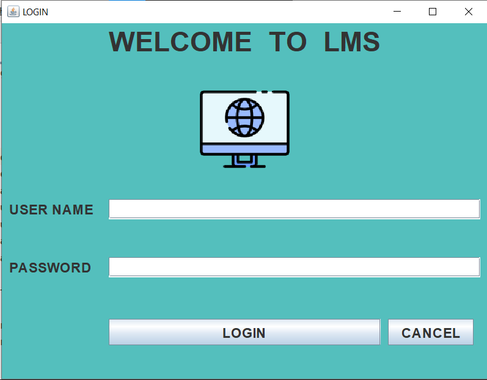
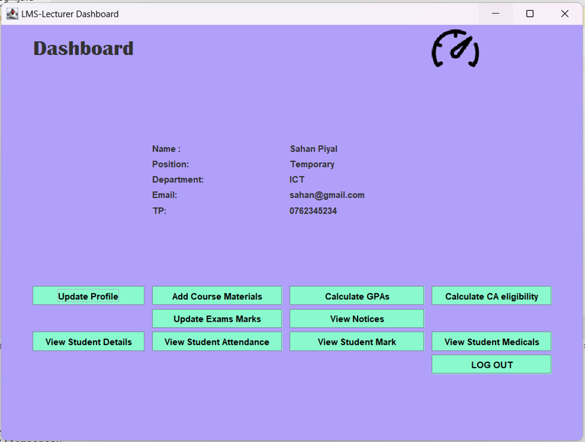
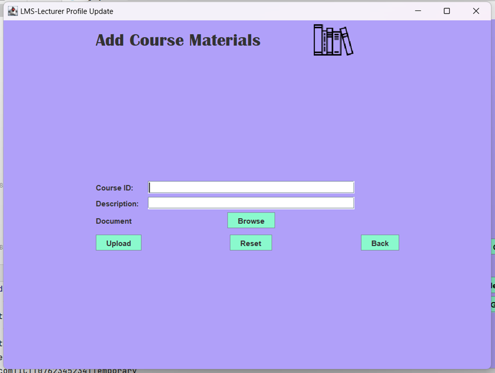

# LMS-in-Java



## Overview

LMS-in-Java is a comprehensive Learning Management System (LMS) developed in Java. This project aims to provide a platform for managing educational courses, student profiles, lecturer profiles, and administrative tasks efficiently.

## Features

- **User Profiles**: Manage profiles for students, lecturers, technical officers, and administrators.
- **Course Management**: Add, remove, and view courses.
- **Profile Updates**: Update user profiles with personal information and profile pictures.
- **Notices**: Add, remove, and view notices.
- **Medical Records**: View and manage student medical records.
- **Grades**: View and update student grades.
- **Attendance**: Track student attendance.

## Screenshots

### Login Screen


### Dashboard


### Profile Management



## Getting Started

### Prerequisites

- Java Development Kit (JDK) 8 or higher
- MySQL Database
- IDE (e.g., IntelliJ IDEA, Eclipse)

### Installation

1. Clone the repository:
    ```sh
    git clone https://github.com/your-username/LMS-in-Java.git
    ```
2. Import the project into your IDE.
3. Set up the MySQL database using the `LMSdatabase.sql` file.
4. Add the MySQL connector JAR (`mysql-connector-java-8.0.30.jar`) to your project's classpath.
5. Run the `Main.java` file to start the application.

## Usage

1. Log in using your credentials.
2. Navigate through the dashboard to manage courses, profiles, and notices.
3. Update your profile information and upload profile pictures.
4. View and manage student grades, attendance, and medical records.

---

Thank you for using LMS-in-Java!

